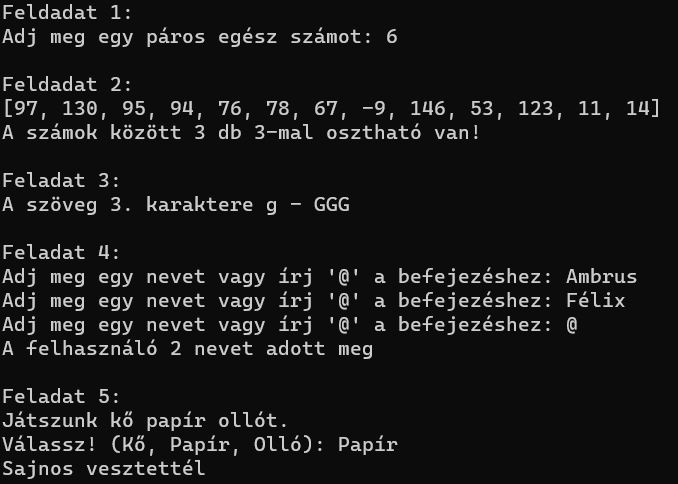

# Dolgozat 

## Gyors leírás
Ez a projekt egy számonkérés. Ennek a kódnak semmi célja nincsen a Python gyakorlásán kívül.

## Feladatok:
### 1.
Az első feladat bekér egy páros számot a felhasználótól. Amennyiben a szám nem páros a program hibát jelez, és újra kéri a számot.
### 2.
A második feladat kiír egy listába 13db random generált számot 10-150 között, majd kiírja hány 3-al osztható számot tartalmazott a lista.
### 3.
A marmadik feladatban a program egy előre definiált szövegben megnézi, hogy a szöveg 3. helyén milyen betű áll, majd kiírja azt 3-szor nagybetűvel. Amennyiben a szöveg vagy a megadott számot úgy változtatjuk meg, hogy a szöveg hossza kisebb mint a szám, a program hibát fog jelezni.
### 4.
A negyedik feladatban a program neveket kér be a felhasználótól amíg nem kapja meg '@' jelet mint input. Ekkor a program kiírja hány nevet adott meg a felhasználó.
### 5.
Az ötödik feladat egy egyszerű kő, papír, olló játék.

## Képernyőkép:
